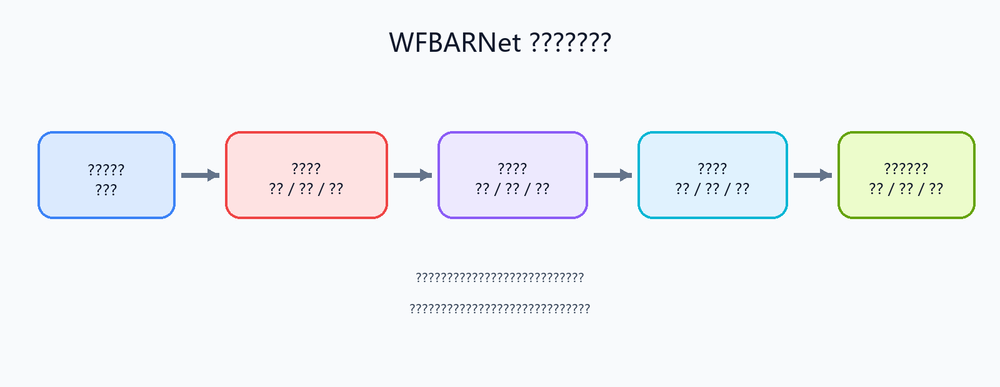

# WFBARNet 技术路线、拟解决的问题及预期成果

## 1. 技术路线

WFBARNet 采用“视频输入、多路感知、事件识别、回合统计、可视化导出”的总体技术路线，目标是把羽毛球比赛或训练视频转化为可解释、可量化的分析结果。系统首先读取本地视频、摄像头画面或批量片段，并完成帧采样、时间戳计算、尺寸缩放和模型输入构造；随后围绕羽毛球、球员和球场三个对象展开联合分析，其中轨迹分支负责输出羽毛球候选点和连续轨迹，姿态分支负责人体框与关键点提取，球场分支负责球场线识别及图像坐标到标准场地坐标的映射。三路结果融合后，系统进一步识别击球、落点和出画等轨迹事件，并在有条件时接入 BST 时序动作识别，最终形成回合时长、击球次数、球员移动距离、速度变化、击球区域分布以及数据可靠性等统计结果。整个流程以 PyQt6 界面为承载，支持分析结果叠加显示、标准球场视图展示以及 JSON、CSV、JSONL 等结构化导出。

从实现方式上看，本项目并不是把所有任务交给单一模型处理，而是采用深度学习与几何方法相结合的思路。羽毛球轨迹跟踪主要借助 TrackNetV3 风格链路并配合候选筛选、连续性修复和误检抑制机制，以适应羽毛球目标小、速度快、易模糊和易出画的特点；球员分析主要使用 YOLO Pose 获取人体关键点，并结合时序信息稳定上下半场球员身份；球场分析则依靠球场分割、白线约束和单应性矩阵估计实现标准场地投影。通过这种多分支协同的架构，系统可以在保证可扩展性的同时，将视频中的检测结果进一步提升为具有实际分析意义的空间指标和回合指标。

## 2. 拟解决的问题

本项目拟重点解决羽毛球视频分析中长期存在的几个核心问题。首先，羽毛球在普通比赛视频中尺寸很小，且运动速度快、轨迹变化剧烈，单纯依赖逐帧检测容易出现漏检、误检和轨迹断裂，因此需要构建更稳定的轨迹解码与滤波机制。其次，球员姿态估计虽然能够提供人体关键点，但在真实视频中常常会受到遮挡、抖动和身份交换影响，导致球员位置、跑动距离和击球归属判断不稳定，因此需要通过球场位置、历史信息和跟踪约束提高姿态结果的一致性。再次，很多现有方法只能在图像像素平面上完成检测，无法准确表达球员站位、击球区域和移动方向等更具分析价值的信息，因此必须引入球场建模与坐标映射，把视频结果转换到标准羽毛球场平面。

除了感知层问题之外，本项目还拟解决“结果难解释、难复盘、难导出”的工程问题。仅有检测框和关键点并不足以支持训练分析，系统还需要把逐帧结果进一步组织成击球事件、回合状态和统计指标，并通过可视化界面、结构化导出和调试日志形成闭环。换句话说，本项目希望解决的不只是“看见球和人”，而是让系统能够回答“何时击球、球员如何移动、回合持续多久、空间分布如何、结果是否可信”等更贴近实际应用的问题。

## 3. 预期成果

预期成果主要体现在系统实现、分析能力和输出形式三个层面。系统实现方面，项目将形成一个能够在本地运行的羽毛球视频分析原型，支持至少一种稳定的视频输入模式，并具备视频预览、分析启动、结果叠加、回合统计和导出功能。分析能力方面，系统预期能够完成羽毛球连续轨迹跟踪、双人姿态提取、球场映射、击球与落点事件识别，以及回合级统计输出，生成包括回合时长、击球次数、球员移动距离、速度指标、前中后场击球分布和数据可靠性在内的结果。输出形式方面，项目将同时提供界面可视化结果与结构化数据结果，支持主画面叠加、标准球场视图、热力图展示，以及 JSON、CSV、JSONL 等格式导出，便于后续复盘、论文撰写和进一步算法实验。

从项目成果表达上看，最终应形成一套较完整的“算法 + 界面 + 日志 + 数据”的本地化分析闭环。它既可以作为羽毛球训练复盘和技战术观察的辅助工具，也可以作为后续研究轨迹优化、击球识别、回合切分和空间统计的实验基础。需要说明的是，本项目的预期成果定位于训练分析和算法验证，而不是自动裁判系统，因此在比分判定、完整多回合自动切分、真实三维球速和高层比赛语义等方面仍然存在边界，这些内容可作为后续进一步研究和扩展的方向。
