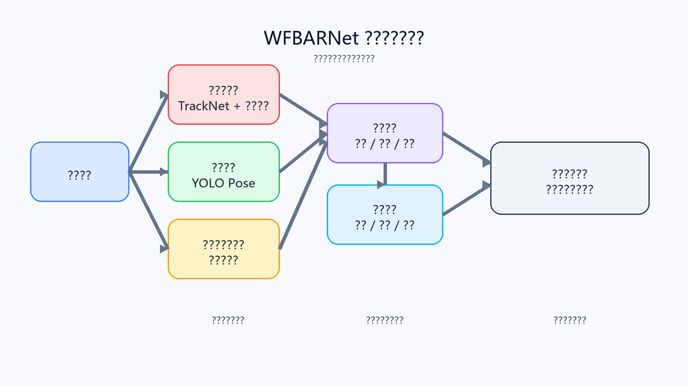

# WFBARNet 创新技术说明

## 1. 项目创新概述

WFBARNet 的创新不在于单独替换某一个模型，而在于把羽毛球轨迹、球员姿态、球场映射、事件识别和回合统计整合成一条完整的数据链路。传统方案往往只解决“检测到球”或“识别到人”的局部问题，而本项目更强调从视频帧出发，同时理解球、球员和球场三类对象之间的关系，再把这些结果转换为可解释、可量化的训练分析数据。

## 2. 核心创新技术

本项目首先构建了“三对象联合分析”框架。系统不是孤立地看羽毛球或球员，而是把球轨迹、人体关键点和球场空间放到同一个分析流程里处理。这样做的意义在于，系统不仅能知道球在哪里、球员在哪里，还能进一步判断球员在标准场地中的站位、移动方向以及击球发生的空间区域，从而让分析结果从像素层面提升到战术和训练可以直接理解的场地层面。

第二个创新点是多分支异构推理与轨迹连续性修复。羽毛球目标小、速度快、容易模糊和出画，单靠逐帧检测很难稳定输出，因此系统在轨迹模型之后加入候选点筛选、短时缺失补偿、静态热点抑制和重锁定等后处理机制，把模型输出从“候选结果”进一步变成“稳定轨迹”。与此同时，姿态分支、球场分支和可选动作分支各自负责不同任务，既发挥了不同算法的优势，也保证了后续功能可以继续扩展。

第三个创新点是基于球场映射和规则事件的可解释分析。系统通过球场检测和单应性矩阵，把视频中的像素坐标转换到标准羽毛球场平面，使球员跑动距离、热力图和前中后场击球分布具备实际意义。在此基础上，系统不直接依赖黑盒模型去判断所有事件，而是利用轨迹的速度变化、方向反转和可见性变化识别击球、落点和出画事件。这样的好处是结果更容易调试，也更方便在答辩或报告中说明“为什么会得出这个结论”。

第四个创新点是回合级统计与本地化闭环。WFBARNet 最终输出的不只是逐帧检测框，而是回合时长、击球次数、球员移动距离、速度变化、击球区域分布以及球点可见率、姿态有效率、球场有效率等质量指标。系统还通过 PyQt6 界面、逐帧 JSONL 和轨迹调试 CSV 保留分析过程，使使用者既能直观看结果，也能在出现误检或漏检时回溯原因。这种“可视化展示 + 数据导出 + 日志调试”的闭环，是项目从算法原型走向可用系统的重要体现。

## 3. 技术流程示意

上图概括了本项目的核心思路：从视频输入开始，分别对羽毛球、球员和球场进行联合感知，再通过事件识别和回合统计形成可直接用于训练复盘的数据结果。这张图能够帮助理解，项目的创新并不是单点模型，而是多模块协同后的系统化输出能力。

## 4. 总结

总体来看，WFBARNet 的创新主要体现在三方面：一是把球、球员和球场统一进同一条分析链路；二是通过轨迹修复、球场映射和规则事件识别提升结果的稳定性与可解释性；三是把检测结果进一步组织成回合级统计和本地调试闭环。也正因为如此，系统不仅能够“看见”视频中的运动目标，还能够把比赛或训练过程转化为可以复盘、可以量化、可以验证的数据结果。
